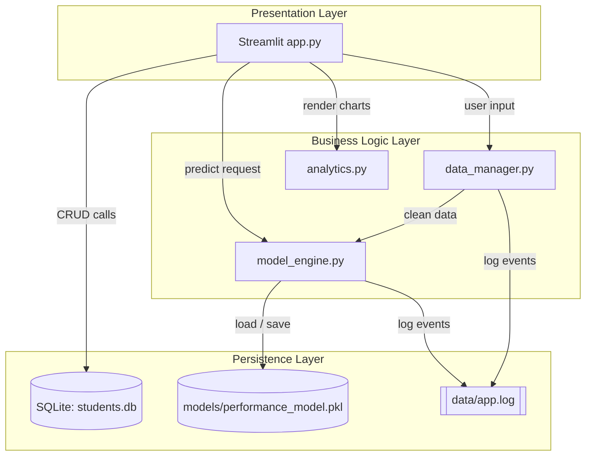
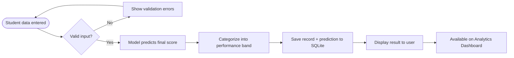
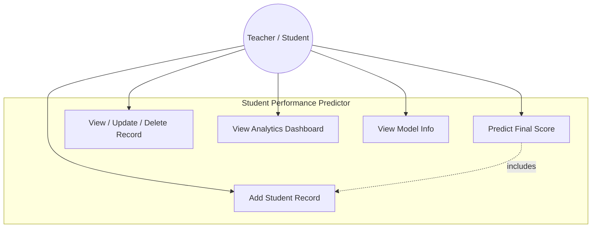
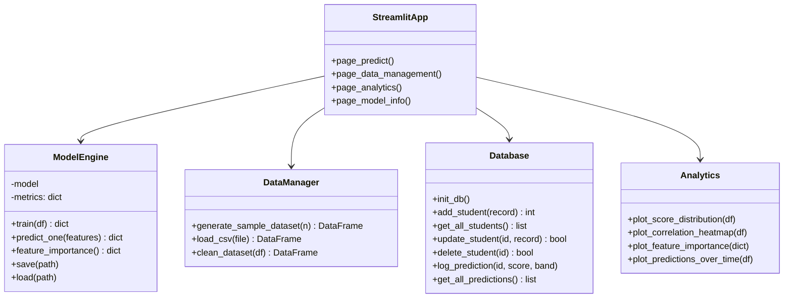
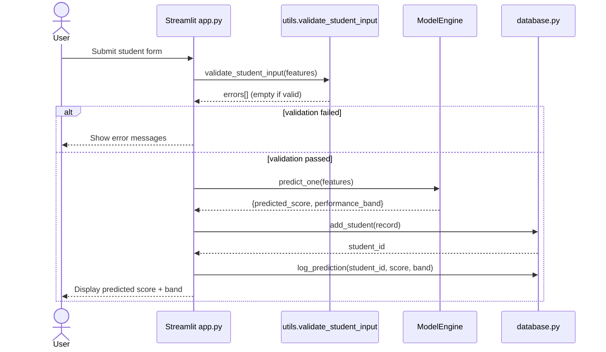
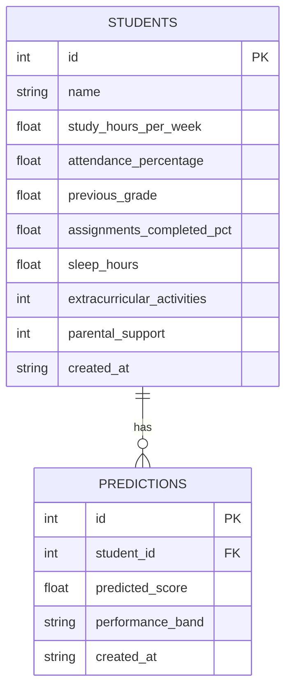

# Design Documentation

These diagrams satisfy the "Design & Documentation Requirements" section of
the project brief. GitHub renders Mermaid diagrams natively — view this file
on github.com to see them, or paste each block into
[mermaid.live](https://mermaid.live) to export a PNG for the PDF report.

## 1. System Architecture

## 2. Process / Workflow Diagram

## 3. Use Case Diagram

## 4. Class / Component Diagram

## 5. Sequence Diagram (Prediction Flow)

## 6. Entity-Relationship Diagram

## Dataset Description

Training uses a synthetically generated dataset (`generate_sample_dataset`
in `modules/data_manager.py`) of 800 records. The target `final_score` is
built as a weighted, noisy combination of the seven features so the
relationship is realistic but not perfectly linear — this is done so the
project is fully reproducible without depending on an external download,
while still giving both candidate models genuine signal to learn from. A
`load_csv()` function is also provided so real institutional data (matching
the same schema) can be substituted directly.
